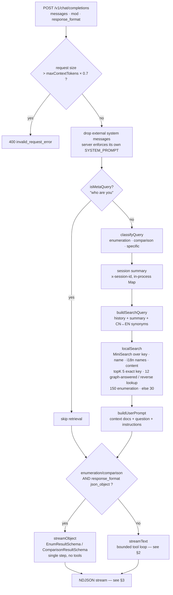
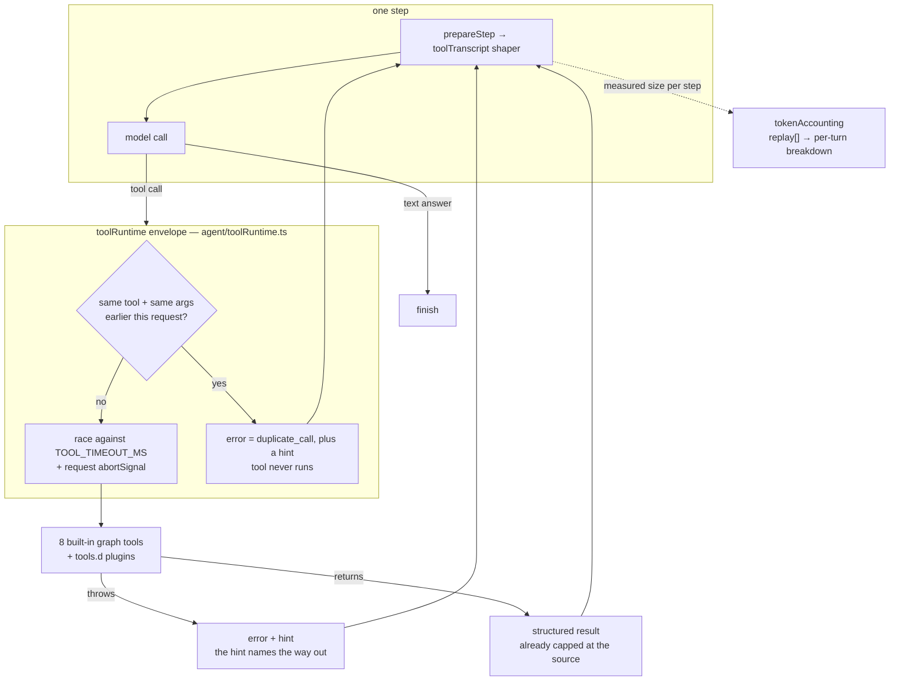
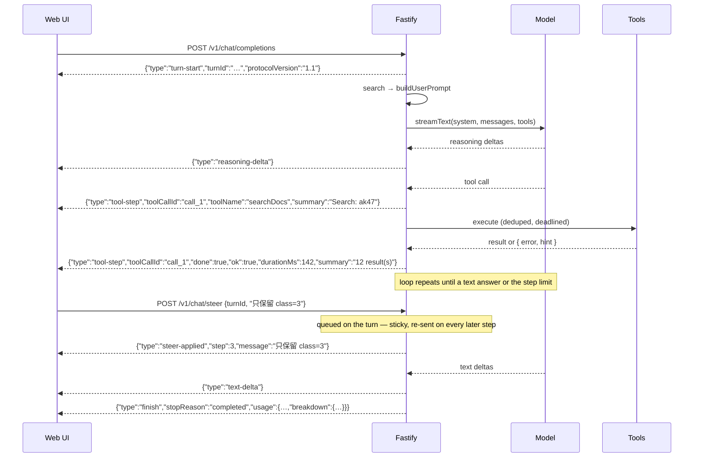
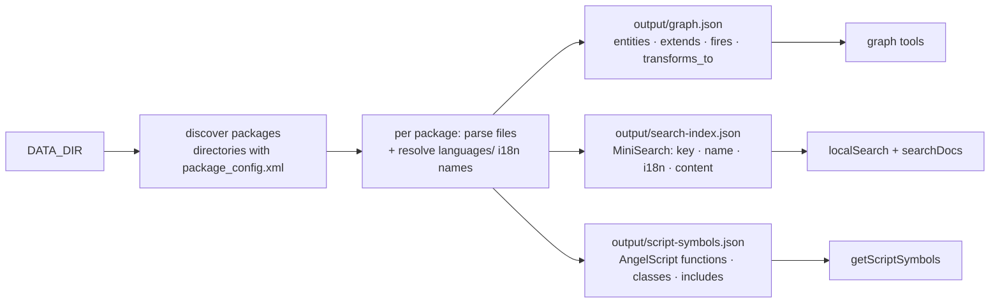

# Architecture

How a question becomes an answer, and how the local RWR game files become a searchable index.

For coding conventions and per-module notes see [`AGENTS.md`](./AGENTS.md).

---

## 1. Request pipeline

`POST /v1/chat/completions` is OpenAI-compatible on the surface; everything below the entry point is
local. No vector database, no embedding service — MiniSearch plus an entity graph, both in-process.

The retrieved context is **one** search on **one** rewritten phrasing, so the system prompt forbids
answering "not found" until the model has searched with tools itself. That rule is the reason the
tool loop exists at all.

## 2. Tool loop

`streamText` drives the loop: the model thinks, calls tools, observes structured results, and repeats
until it produces a text answer or hits `stopWhen: stepCountIs(MAX_TOOL_STEPS)` (default 100). There is no free-text
`Thought:` / `Action:` protocol — the shape comes from the SDK's tool calling.

Every step re-sends the whole prompt, which is why both the shaper and the accounting exist.

**Failures never break the stream.** A throwing tool, a timeout, an aborted request and a rejected
duplicate all leave the envelope as a `{ error, hint }` value, which reaches the model as an ordinary
tool result it can route around. The consequence for consumers: a *failed* call arrives as
`tool-result`, not `tool-error`, so success is read off the output shape (`isToolFailure`).

**Tool results are replayed in full.** The shaper only sheds them when a step's prompt would
overflow the window (`maxContextTokens × TOOL_CONTEXT_BUDGET_RATIO`, minus the system prompt, the
tool definitions and the output reservation). With the default window that effectively never happens.
When it must shed, it drops whole array items and clips long strings rather than cutting mid-JSON, so
the value stays valid JSON and carries a `_shed` note; the newest result is never touched. Blindly
compressing older results costs answer quality on multi-step enumerations, where those results *are*
the answer.

**Only the base survives the turn.** Tool calls and results live inside one turn's loop — the next
request carries only the system prompt, the tool definitions, fresh retrieved context, and the
user/assistant conversation. That is why the usage bar and the cumulative In/Out numbers are
deliberately different quantities.

## 3. NDJSON stream

Custom NDJSON, one JSON object per line keyed by `type` — not SSE.

| Line | Meaning |
|---|---|
| `turn-start` | first line: `turnId` (the steer/stop key) + `protocolVersion` |
| `text-delta` | answer text |
| `reasoning-delta` | model reasoning, rendered separately |
| `json-delta` | partial object, structured mode only |
| `tool-step` | opening (`summary`) then closing (`done`, `ok`, `durationMs`), paired by `toolCallId` |
| `steer-applied` | a mid-stream instruction reached the loop — once per message, not per step |
| `finish` | `stopReason` (`completed` / `step-limit` / `output-limit` / `stopped`) + usage and its per-slice breakdown |
| `error` | the stream itself broke — **not** used for tool failures or stop reasons |

`finish.usage` separates **spend** from **occupancy**: `promptTokens`/`completionTokens` sum every
step of the loop, while `contextTokens` is what the next request will carry. `breakdown` attributes
the totals across system prompt, tool definitions, retrieved context, conversation, tool transcript,
reasoning, tool-call arguments and answer, listing in `exact` which figures the provider reported
verbatim rather than estimated.

## 4. Index build

Runs on boot when the index is missing or stale, and on demand via `npm run build:index`.
Staleness is decided by `INDEX_VERSION` plus a file-count and max-mtime fingerprint.

AngelScript is handled by a **symbol scanner**, not a full parser: one `script_chunk` document per
`.as` file plus extracted signatures with line numbers. Tag-shaped matching must never be applied to
`.as` files — generics like `array<Soldier>` were once misparsed as entity definitions.
