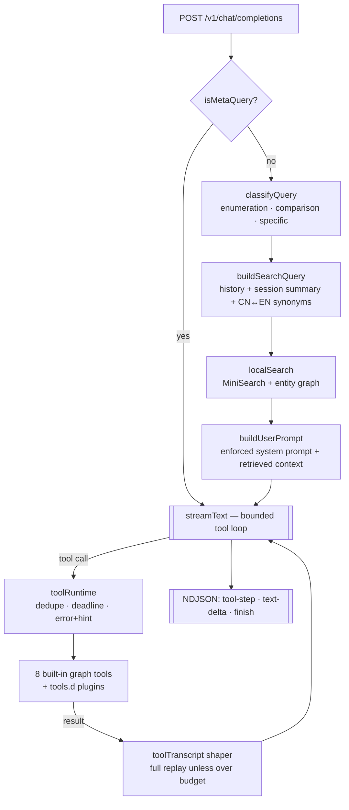

# Running With Rifles AI Agent

An AI agent that answers questions about *Running With Rifles* game data — weapons, vehicles, soldiers, carry items, calls and AngelScript game modes — over an **OpenAI-compatible** `/v1/chat/completions` API, with a built-in chat UI.

Retrieval runs entirely **in-process from the game files on disk**: a MiniSearch full-text index plus an entity graph. No database, no embedding service, no vector store.

[中文文档](./README_zh.md)

## Stack

- **Node.js + TypeScript** (ESM, strict)
- **Fastify** — HTTP server
- **MiniSearch** — local full-text index (CJK-aware tokenization)
- **Vercel AI SDK** — LLM streaming + tool calling
- **Svelte 5 + Vite + Tailwind 4 + daisyUI** — chat UI
- **fast-xml-parser** — game file parsing

## Quick Start

```bash
npm install
cp .env.example .env      # fill in LLM_API_KEY
npm run dev
```

That's it. On first boot the server discovers the packages under `DATA_DIR` (default `./data`), builds the indexes into `./output`, and starts serving on `http://localhost:3000`.

### Pointing at your game data

`DATA_DIR` can be either a **single package** (a directory containing `package_config.xml`) or a **directory of packages**:

```bash
DATA_DIR=./data       npm run dev   # single package: GFL_Castling
DATA_DIR=./ww2-data   npm run dev   # 5 packages: ww2_base, edelweiss, pacific, …
```

Packages are discovered automatically by looking for `package_config.xml` in the root and its immediate subdirectories. Every document is tagged with its package name, and a request can be restricted to one package.

### Rebuilding the index

The index rebuilds automatically when it is missing or when the source files changed (file count or newest mtime). To force it:

```bash
npm run build:index                          # uses DATA_DIR / OUTPUT_DIR
npm run build:index -- --source ./ww2-data   # explicit source
npm run build:index -- --only ww2_base,pacific
```

Set `AUTO_BUILD_INDEX=false` to require the explicit command.

## API

### POST /v1/chat/completions

OpenAI-compatible chat completions with built-in retrieval.

```bash
curl -X POST http://localhost:3000/v1/chat/completions \
  -H "Content-Type: application/json" \
  -d '{
    "model": "rwr-agent",
    "messages": [{"role": "user", "content": "What weapons have class=3?"}],
    "stream": false
  }'
```

Extra fields beyond the OpenAI schema:

| Field | Description |
|---|---|
| `mod` | Restrict retrieval to a single package (see `GET /v1/packages`) |
| `response_format: {"type":"json_object"}` | Return a structured enumeration/comparison object instead of prose |

Headers: `x-session-id` enables rolling conversation summaries across requests.

> **Note:** external `system` messages are dropped — the server enforces its own system prompt.

### GET /v1/packages

Lists the packages present in the built index.

```json
{
  "data_dir": "/path/to/data",
  "built_at": "2026-07-27T09:56:57.335Z",
  "packages": [
    { "name": "ww2_base", "displayName": "WW2: Base", "count": 3144 },
    { "name": "pacific",  "displayName": "WW2: Pacific Theater", "count": 128 }
  ]
}
```

### GET /v1/tools

Lists the tools the model can call — seven built-ins plus anything loaded from the plugin directory, including per-file load errors.

```json
{
  "builtin": ["getInheritanceChain", "findReferences", "…"],
  "plugins": [{ "name": "lookupUpgrade", "file": "lookup-upgrade.js", "description": "…", "loadedAt": "…" }],
  "toolsDir": "/app/tools.d",
  "hotReload": true
}
```

### GET /v1/models

Returns available models.

### GET /health

Reports index state — no external dependency is checked.

```json
{
  "status": "ok",
  "index": { "ready": true, "documents": 9861, "packages": ["GFL_Castling"], "builtAt": "…" }
}
```

### Streaming

Set `stream: true`. The response is **newline-delimited JSON**, not OpenAI SSE. Each line is one object with a `type`: `text-delta`, `reasoning-delta`, `json-delta`, `finish`, `error`.

```bash
curl -N http://localhost:3000/v1/chat/completions \
  -H "Content-Type: application/json" \
  -d '{"model":"rwr-agent","stream":true,"messages":[{"role":"user","content":"G36 的伤害是多少"}]}'
```

## Architecture



The tool loop, the transcript shaper, the stream event contract and the index build are documented in
**[ARCHITECTURE.md](./ARCHITECTURE.md)**.

## Tool Plugins

Beyond the seven built-in graph tools, you can drop your own tools into `./tools.d` (configurable via `TOOLS_DIR`). They are picked up at startup and, outside production, reloaded when the file changes — no restart.

A plugin is a plain ESM **`.js`** file (not `.ts` — production runs compiled output with no transpiler) whose default export returns tool specs:

```js
/** @type {import('../types/tool-plugin.js').PluginFactory} */
export default function register(host) {
  return [{
    name: 'findByFaction',
    description: 'List weapons belonging to a faction.',
    inputSchema: {
      type: 'object',
      properties: { faction: { type: 'string' } },
      required: ['faction'],
    },
    async execute({ faction }) {
      return host.search('weapon', { faction, type: 'weapon' }, 20);
    },
  }];
}
```

`host` exposes the index paths, `search()`, and the graph primitives (`getNode`, `getInheritanceChain`, `readSource`, …) — see [types/tool-plugin.d.ts](./types/tool-plugin.d.ts). Schemas are JSON Schema, so plugins carry no dependency on the server's validation library.

A broken plugin is skipped with its error reported on `GET /v1/tools`; the rest keep working. A plugin cannot take over a built-in tool's name.

`tools.d/lookup-upgrade.js` ships as a working example (Castling weapon upgrade chains).

> ⚠️ **Plugins run inside the server process with its full privileges** — filesystem, network, environment. Only put files there that you wrote or reviewed. This is not a sandbox, and the plugin directory must never be wired to untrusted uploads.

## Supported File Types

| Extension | Type | Parser |
|-----------|------|--------|
| `.weapon`, `.projectile`, `.carry_item`, `.call`, `.character`, `.xml`, … | XML | Tag-driven parser with inheritance resolution |
| `.as` | AngelScript | Symbol scanner — classes, functions (incl. multi-line signatures and default args), members, `enum`/`namespace`/`funcdef`, `#include` |
| `.ai`, `.resources`, `.name`, `.text_lines` | Plain text | Fallback text |

`models/` and `maps/` subtrees are skipped.

## Development

```bash
npm run dev             # backend, hot reload
npm run web:dev         # frontend dev server (:5173, proxies to the backend)
npm run build           # tsc → dist/ and vite build → public/
npm run build:index     # rebuild the indexes
npm run validate:index  # smoke-test the graph tools
npm run eval            # retrieval eval harness
npm run format          # Prettier
npx tsc --noEmit        # typecheck
```

## Deployment

### Docker

```bash
docker compose up -d --build
```

Mounts `./data` and `./tools.d` read-only at `/app/data` and `/app/tools.d`, and persists the generated indexes in `./output`. Configuration comes from `.env`.

## Configuration

`LLM_API_KEY` is the only required variable. See [.env.example](./.env.example) for the full list; the ones worth knowing:

| Variable | Default | Purpose |
|---|---|---|
| `LLM_API_KEY` | — | **Required.** OpenAI-compatible API key |
| `LLM_BASE_URL` | `https://api.siliconflow.cn/v1` | LLM endpoint |
| `LLM_MODEL` | `deepseek-v4-flash` | Model name |
| `DATA_DIR` | `./data` | RWR data root (single package or directory of packages) |
| `OUTPUT_DIR` | `./output` | Where the generated indexes live |
| `AUTO_BUILD_INDEX` | `true` | Build/refresh the index at startup |
| `TOOLS_DIR` | `./tools.d` | Tool plugin directory (optional) |
| `TOOLS_HOT_RELOAD` | on outside production | Reload changed plugins without a restart |
| `PORT` | `3000` | HTTP port |

## License

See [LICENSE](./LICENSE).
