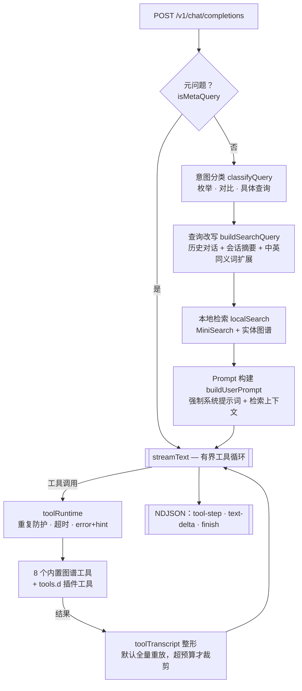

# Running With Rifles AI Agent

[English](/README.md)

> **⚠️ 早期阶段提示**：本项目处于早期开发阶段，版本可能不稳定，随时可能发生破坏性更新。

一个面向 *Running With Rifles* 游戏数据的 AI Agent，回答关于武器、载具、兵种、携带物品、呼叫支援以及 AngelScript 游戏模式的问题，对外提供 **OpenAI 兼容** 的 `/v1/chat/completions` 接口，并自带聊天前端。

检索完全**在进程内、直接基于磁盘上的游戏文件**运行：MiniSearch 全文索引 + 实体关系图。不需要数据库、不需要 embedding 服务、不需要向量库。

## 技术栈

- **Node.js + TypeScript**（ESM，strict）
- **Fastify** — HTTP 服务
- **MiniSearch** — 本地全文索引（支持中文分词）
- **Vercel AI SDK** — LLM 流式输出与工具调用
- **Svelte 5 + Vite + Tailwind 4 + daisyUI** — 聊天前端
- **fast-xml-parser** — 游戏文件解析

## 快速开始

```bash
npm install
cp .env.example .env      # 填写 LLM_API_KEY
npm run dev
```

就这些。首次启动时服务会自动发现 `DATA_DIR`（默认 `./data`）下的数据包，把索引构建到 `./output`，然后在 `http://localhost:3000` 提供服务。

### 指定游戏数据目录

`DATA_DIR` 既可以是**单个数据包**（目录下有 `package_config.xml`），也可以是**装着多个包的目录**：

```bash
DATA_DIR=./data       npm run dev   # 单包：GFL_Castling
DATA_DIR=./ww2-data   npm run dev   # 5 个包：ww2_base、edelweiss、pacific…
```

包的发现规则：在根目录及其**直接子目录**中查找 `package_config.xml`。之所以不递归，是因为 `ww2_base/packages/<overlay>/` 这类子树属于 `ww2_base` 本身，不应被当成独立包。

每条文档都会打上所属包名，请求时可以限定只检索某一个包。

### 重建索引

索引缺失、或源文件发生变化（文件数或最新 mtime 改变）时会自动重建。手动强制重建：

```bash
npm run build:index                          # 使用 DATA_DIR / OUTPUT_DIR
npm run build:index -- --source ./ww2-data   # 显式指定源目录
npm run build:index -- --only ww2_base,pacific
```

设置 `AUTO_BUILD_INDEX=false` 可关闭自动构建，改为只认手动命令。

## API 接口

### POST /v1/chat/completions

OpenAI 兼容的对话接口，内置检索。

```bash
curl -X POST http://localhost:3000/v1/chat/completions \
  -H "Content-Type: application/json" \
  -d '{
    "model": "rwr-agent",
    "messages": [{"role": "user", "content": "class=3 的武器有哪些？"}],
    "stream": false
  }'
```

在 OpenAI schema 之外新增的字段：

| 字段 | 说明 |
|---|---|
| `mod` | 限定只检索某一个数据包（取值见 `GET /v1/packages`） |
| `response_format: {"type":"json_object"}` | 返回结构化的枚举/对比对象，而非自然语言 |

请求头：`x-session-id` 用于开启跨请求的会话滚动摘要。

> **注意**：外部传入的 `system` 消息会被丢弃 —— 服务端强制使用自己的系统提示词。

### GET /v1/packages

列出当前索引中的数据包。

```json
{
  "data_dir": "/path/to/data",
  "built_at": "2026-07-27T09:56:57.335Z",
  "packages": [
    { "name": "ww2_base", "displayName": "WW2: Base", "count": 3144 },
    { "name": "pacific",  "displayName": "WW2: Pacific Theater", "count": 128 }
  ]
}
```

### GET /v1/tools

列出模型可调用的工具 —— 7 个内置工具 + 插件目录里加载成功的工具，加载失败的会带 `error` 字段。

```json
{
  "builtin": ["getInheritanceChain", "findReferences", "…"],
  "plugins": [{ "name": "lookupUpgrade", "file": "lookup-upgrade.js", "description": "…", "loadedAt": "…" }],
  "toolsDir": "/app/tools.d",
  "hotReload": true
}
```

### GET /v1/models

返回可用模型列表。

### GET /health

返回索引状态，不再检查任何外部依赖。

```json
{
  "status": "ok",
  "index": { "ready": true, "documents": 9861, "packages": ["GFL_Castling"], "builtAt": "…" }
}
```

### 流式输出

设置 `stream: true`。响应是 **NDJSON（按行分隔的 JSON）**，不是 OpenAI 的 SSE。每行一个对象，用 `type` 区分：`text-delta`、`reasoning-delta`、`json-delta`、`finish`、`error`。

```bash
curl -N http://localhost:3000/v1/chat/completions \
  -H "Content-Type: application/json" \
  -d '{"model":"rwr-agent","stream":true,"messages":[{"role":"user","content":"G36 的伤害是多少"}]}'
```

## 架构



工具循环、上下文整形、流事件契约与索引构建的完整说明见 **[ARCHITECTURE.md](./ARCHITECTURE.md)**。

## 数据解析

### 支持的文件类型

| 扩展名 | 类型 | 解析器 |
|--------|------|--------|
| `.weapon`、`.projectile`、`.carry_item`、`.call`、`.character`、`.xml` 等 | XML | 标签驱动解析，含继承（`file=`）解析 |
| `.as` | AngelScript | 符号扫描：类、函数（含多行签名与默认参数）、成员变量、`enum`/`namespace`/`funcdef`、`#include` |
| `.ai`、`.resources`、`.name`、`.text_lines` | 纯文本 | 兜底文本处理 |

`models/` 与 `maps/` 子树会被跳过。

### AngelScript 与脚本检索

`asSymbols.ts` 是一个「注释与字符串置空后的逐行 + 括号计数扫描器」，不是完整语法解析器 —— 但足以覆盖真正影响召回的情况：多行签名、带默认值的参数、类成员、构造/析构、`enum` / `namespace` / `funcdef`。

每个 `.as` 文件生成**一条** `script_chunk` 文档。由于 `structuredDocToRWRDocument` 只把 `raw_text` 的前 500 字符放进可检索内容，符号摘要被写入 `description` 与 `flat_attributes`（`classes` / `functions` / `includes` / …，每项最多 120 个名字）—— 这两处会被完整拼进 content。因此「哪个脚本定义了 X」「哪些脚本 include 了 Y」可以直接被全文检索命中，而不必先让模型猜对文件名。

关于 tree-sitter：只有在需要调用图、跨文件符号解析或 `#include` 依赖图时才值得引入。目前 npm 上没有发布 AngelScript 语法（[Relrin/tree-sitter-angelscript](https://github.com/Relrin/tree-sitter-angelscript) 覆盖最全但需自行 clone 构建），采用它意味着自己编出 `.wasm` 并入库。迁移面只有一个函数：`extractScriptSymbols(source, fileBase)`。

### 中文检索

- 构建索引时，`resolveI18n()` 会**按包**读取该包自己的 `languages/` 目录，把译名写入索引的 `i18nNames` 字段。只索引 `cn` / `en`：其余 8 种语言的文件是 ISO-8859-1 编码，读出来是乱码，而且全部索引会稀释词频。
- `tokenize()` 把连续的中日韩字符切成**单字 + 二元组**，让「伤害」「突击步枪」这类词无需分词词典就能命中。该切分只作用于查询和短字段（`key`/`name`/`i18nNames`/`type`），**不作用于 `content`** —— 否则游戏里那些超大的本地化文本块会淹没真正的结果。中文词条不做模糊匹配和前缀匹配。

## 工具插件

除了 7 个内置图谱工具，你可以把自己的工具放进 `./tools.d`（用 `TOOLS_DIR` 改路径）。启动时自动加载；在非生产环境下，改文件即生效，不用重启。

插件是普通的 ESM **`.js`** 文件（不能是 `.ts` —— 生产跑的是编译产物，加载链上没有转译器），默认导出一个返回工具定义的工厂：

```js
/** @type {import('../types/tool-plugin.js').PluginFactory} */
export default function register(host) {
  return [{
    name: 'findByFaction',
    description: '列出属于某个阵营的武器。',
    inputSchema: {
      type: 'object',
      properties: { faction: { type: 'string' } },
      required: ['faction'],
    },
    async execute({ faction }) {
      return host.search('weapon', { faction, type: 'weapon' }, 20);
    },
  }];
}
```

`host` 提供索引路径、`search()` 以及全部图谱原语（`getNode`、`getInheritanceChain`、`readSource` 等），类型定义见 [types/tool-plugin.d.ts](./types/tool-plugin.d.ts)。schema 用 JSON Schema，插件因此不依赖服务端的校验库版本。

插件写坏了会被跳过并在 `GET /v1/tools` 里带上错误信息，其它工具不受影响；插件也无法覆盖内置工具的同名工具。

`tools.d/lookup-upgrade.js` 是随仓库提供的可用样例（Castling 武器升级链）。

> ⚠️ **插件在服务进程内运行，拥有与主进程相同的权限** —— 文件系统、网络、环境变量。只放你自己写过或审过的文件。这不是沙箱，插件目录**绝不能**接第三方上传。要开放上传必须换 `worker_threads` 隔离方案。

## 开发

```bash
npm run dev             # 后端，热重载
npm run web:dev         # 前端开发服务器（:5173，反代到后端）
npm run build           # tsc → dist/ 且 vite build → public/
npm run build:index     # 重建索引
npm run validate:index  # 图谱工具冒烟测试
npm run eval            # 检索评测
npm run format          # Prettier
npx tsc --noEmit        # 类型检查
```

> `npm run lint` 目前不可用：ESLint 10 要求 `eslint.config.js`，本仓库尚未提供。请用 `npx tsc --noEmit` 做检查。

## 部署

### Docker

```bash
docker compose up -d --build
```

以只读方式把 `./data` 挂到 `/app/data`、`./tools.d` 挂到 `/app/tools.d`，并把生成的索引持久化在 `./output`。配置从 `.env` 读取。

## 配置

只有 `LLM_API_KEY` 是必填。完整列表见 [.env.example](./.env.example)，常用的几个：

| 变量 | 默认值 | 用途 |
|---|---|---|
| `LLM_API_KEY` | — | **必填**，OpenAI 兼容的 API Key |
| `LLM_BASE_URL` | `https://api.siliconflow.cn/v1` | LLM 接口地址 |
| `LLM_MODEL` | `deepseek-v4-flash` | 模型名 |
| `DATA_DIR` | `./data` | RWR 数据根目录（单包或多包目录） |
| `OUTPUT_DIR` | `./output` | 索引输出目录 |
| `AUTO_BUILD_INDEX` | `true` | 启动时自动构建/刷新索引 |
| `TOOLS_DIR` | `./tools.d` | 工具插件目录（可选） |
| `TOOLS_HOT_RELOAD` | 非生产环境默认开 | 改插件文件后不重启即生效 |
| `PORT` | `3000` | HTTP 端口 |

## 许可证

见 [LICENSE](./LICENSE)。
